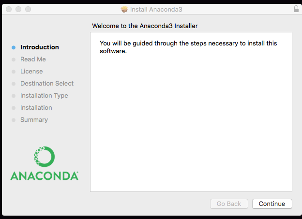
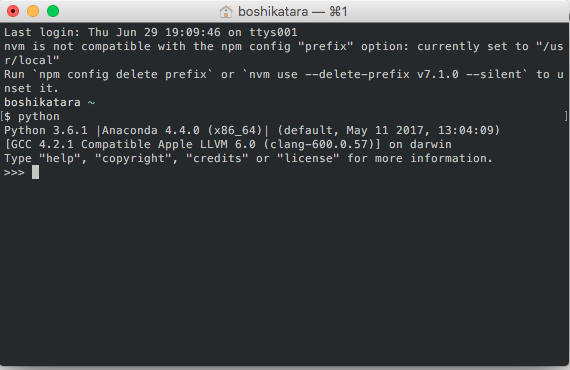
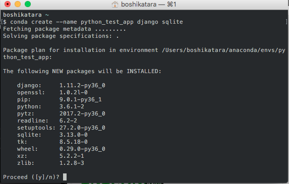

# 🐍Python Installation Guide
**Note- Python 3 vs Python 2**

## [Install Python using Anaconda)[https://www.continuum.io/downloads]
What is Anaconda?
Anaconda is a data science platform that comes with a lot of 
useful features right out of the box. Many people find that 
installing Python through Anaconda is much easier than doing 
so manually. Especially if you are a Windows user or a beginner,
 you will appreciate this even more.
Anaconda not only comes with a Python distribution, it also has a
package manager called 'conda', lot of pre-installed packages and way
to manage environments. 

### Installation
Go to https://www.continuum.io/downloads, choose a download
for your OS. We will be downloading the 'Graphical Installer'.
Once the download is complete, open the installer, and walk-through
the guided steps.

Once the install is complete, test to make sure Python has been installed 
correctly. Open a terminal window and type python. You should see something 
like this

You should see a Python version, and the Anaconda distribution.
**Note: To exit the Python environment, just type exit()**

### PIP
[A description of what pip is]
With Anaconda pip should already be installed. Lets test this, in the terminal window
type
```py
pip list
```
You should see a long list of packages that were installed.

### Conda
Anaconda also comes with its own package manager called 'conda'.
Conda is great if you want to install non-python dependencies that 
mightnot be able to be installed using 'pip'. To see a list of 
commands available to you with conda, type
```py
conda --help
```
Lot of the conda commands are similar to pip commands.
```py
conda list
```
Once you run the above command you will see that lot of packages that ecist
unde 'pip', are also listed under 'conda'. If in the future you need
a package try running **conda install <package name>**, if this does not work
you can use **pip install <package name>**.

#### Conda and Virtual Environment
What is virtualenv?
Say you are working on different projects, that use different
environments, virtualenv makes it easier to manage
different project dependencies, by isolating and creating seperate
virtual environment for each project, so you are not confirming to.
global installations for everythin.
 You can read more about it here http://python-guide-pt-br.readthedocs.io/en/latest/dev/virtualenvs/ 
Why conda is a good alternate?
You can make virtual environments using conda, it is a good alternate
to virtualenv.
Lets try this. Try creating a new application
using 'conda create'.
```py
conda create --name python_test_app django
```
You should see this

press 'Yes' to continue. At the end of the 
installation you should see
```py
# To activate this environment, use:
# > source activate python_test_app
#
# To deactivate this environment, use:
# > source deactivate python_test_app
#
```
To activate the app is a little different between Windows
and Mac.
For Mac
```py
source activate python_test_app
```

For Windows
```py
activate python_test_app
```

Once you run this, re-run
```py
pip list
```
You will see that only the packages that exist in the
virtual environment that you create for this application
will be listed. Now run
```py
which python
```
you should see something like this
```py
/Users/boshikatara/anaconda/envs/python_test_app/bin/python
(python_test_app) boshikatara ~
```
**Note- I ran this on my laptop, hence it displays my unique path
, for you it might be different**
To deactivate, just type 'deactivate'(Windows), or 'source deactivate'
(Mac). 
For more on conda commands, here is a really helpful [Cheatsheet for Conda](https://conda.io/docs/using/cheatsheet.html).

